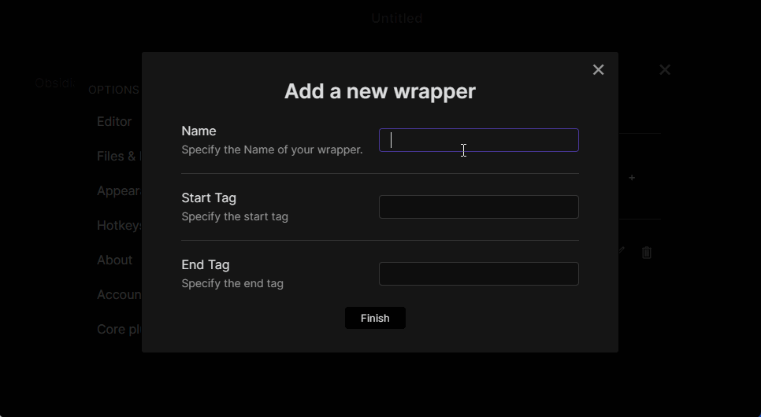
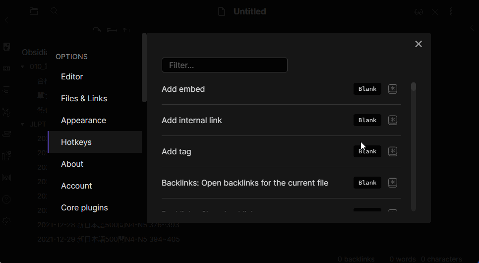
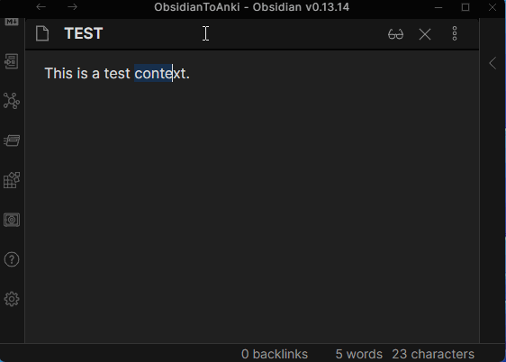

> [!warning]
> This repository is a fork of [Obsidian Wrap With Shortcuts](https://github.com/manic/obsidian-wrap-with-shortcuts).
> It integrate mainly the change done by @1C0D with their own fork [Obsidian Wrap With Shortcuts - No restart](https://github.com/1C0D/obsidian-wrap-with-shortcuts-no-restart)
> My own change is more than refactoring (move `main.ts` to `src`, move assets, etc.) and add a release workflows.

## Obsidian Wrap With Shortcuts

Wrap the selected text in customized tags with shortcuts.

**Underline** is provided with `Ctrl-u`(`Cmd-u`) as default wrappers.

### Procedure

#### Create a **wrapper**

#### Restart Obsidian, Go Settings -> Hotkeys

#### Use the **wrapper**

### Special Thanks

- [Benature](https://github.com/Benature) for [obsidian-underline](https://github.com/Benature/obsidian-underline). This project is forked from his!
- [phibr0](https://github.com/phibr0) for [obsidian-macros](https://github.com/phibr0/obsidian-macros). I got really good examples for plugin settings.
- [1C0D](https://github.com/1C0D/obsidian-wrap-with-shortcuts-no-restart) for their own fork of this plugin.
- [Manic](https://github.com/manic/obsidian-wrap-with-shortcuts) : Original author of this plugin.

### Support me

If you find this plugin helpful, consider supporting me:

