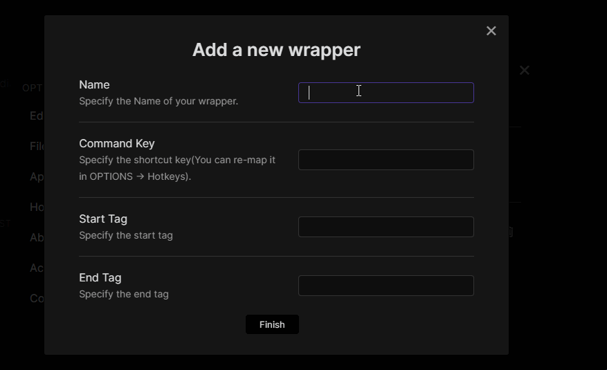

## Obsidian Wrap With Shortcuts

Wrap the selected text in customized tags with shortcuts.

**Underline** is provided with `Ctrl-u`(`Cmd-u`) as default wrappers.

### Procedure

- Create a **wrapper**

- Use the **wrapper**

### Support me

If you find this plugin helpful, consider supporting me:

